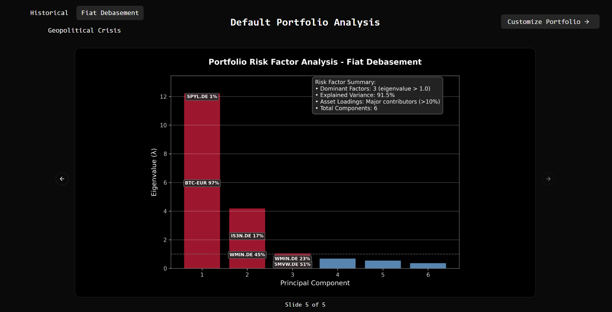

# Monte Carlo Portfolio Simulation

Full-stack Monte Carlo simulation platform with **Python simulation engine**, **FastAPI backend**, and **React frontend**. Features regime-dependent risk modeling, customizable portfolios, and interactive visualizations. Explore how macroeconomic shifts impact portfolio outcomes through real market data, advanced financial mathematics, and intuitive web interface.

## 🎯 Project Overview

- **Full-stack architecture**: Python simulation engine + FastAPI + React dashboard
- **Default portfolio simulation** with pre-configured 6-asset portfolio across 3 regimes (historical, fiat debasement, geopolitical crisis)
- **Fully customizable portfolios** with interactive web interface - modify tickers, weights, asset count, mean/volatility factors, and correlation adjustments
- **Advanced financial mathematics**: Regime-dependent risk modeling with sophisticated correlation adjustments
- **Professional visualizations**: Interactive charts with Monte Carlo paths, correlation matrices, and risk analysis
- **Real-time portfolio validation** with form feedback and error handling
- **Cloud-native deployment**: Containerized with Docker, deployed on Google Cloud Run (GCP)

## 📸 Screenshots & Demo

**Live Frontend**: [mc-frontend (Cloud Run)](https://mc-frontend-668378177815.europe-west1.run.app)
**Live Backend API**: [mc-backend (Cloud Run)](https://mc-backend-668378177815.europe-west1.run.app/docs)

### Default Portfolio Dashboard


_Interactive dashboard with portfolio composition and regime analysis_

### Monte Carlo Simulation Results


_1000 simulation paths showing potential portfolio outcomes with confidence intervals_

### Portfolio Builder Interface


_Interactive form with real-time validation - create any portfolio combination_

### Risk Analysis Dashboard

<details>
<summary>📊 View Additional Analysis Charts</summary>


_Asset correlation heatmap showing regime-dependent relationships_


_Principal component analysis identifying dominant risk factors_

</details>

## 🏗️ Architecture & Features

**Modular Monolith Architecture:**

- **Backend** (`backend/`) - Organized monolith with modular structure: simulation engine, shared core utilities, and FastAPI API layer
  - `core/` - Shared utilities (logging, data fetching, risk metrics)
  - `simulation/` - Monte Carlo engine with comprehensive test coverage
  - `optimization/` - Future portfolio optimization module
- **Frontend** (`frontend/src/`) - React dashboard with TypeScript, interactive visualizations, and real-time validation

**Technology Stack:**

- **Backend**: Python, FastAPI, NumPy, Pandas, Matplotlib, yfinance, pytest (testing), Pydantic (type validation), structured logging
- **Frontend**: React 19, TypeScript, Vite, shadcn/ui, Recharts, TanStack Query, Zustand
- **Testing & Quality**: pytest, comprehensive test coverage, type hints, linting
- **Cloud & DevOps**: Docker, Google Cloud Run, Google Artifact Registry

## 🎨 Frontend Features

**Interactive Portfolio Dashboard:**

- **Portfolio Composition Chart** - Pie chart visualization of asset weights
- **Regime Factors Radar Chart** - Visual comparison of mean/volatility factors and correlation adjustments
- **Three Generated Visualizations** - Monte Carlo simulation paths, correlation matrix heatmap, PCA risk factor analysis

**Fully Customizable Form:**

- **Dynamic asset management** - Add/remove tickers with real-time validation
- **Custom weightings** - Adjustable portfolio weights with automatic normalization
- **Date range selection** - Historical data period customization
- **Regime parameter tuning** - Individual mean/volatility factors per asset
- **Global correlation adjustment** - Portfolio-wide correlation modification
- **Real-time feedback** - Form validation with error messages and success indicators

## 📊 Backend Simulation Features

**Generated Outputs (each regime produces):**

- **Monte Carlo simulation paths** - Confidence intervals, key trajectories, risk metrics (VaR, CVaR)
- **Correlation matrix heatmap** - Asset correlations with matrix conditioning analysis
- **PCA risk factor analysis** - Principal components, explained variance, factor loadings

**Key Metrics:**

- Complete portfolio performance statistics (median, mean, best/worst case outcomes)
- Professional risk assessment with confidence intervals and stress testing
- Systematic risk factor identification and asset contribution analysis

**Advanced Mathematical Methodology:**

- **Data Foundation**: Historical daily returns from Yahoo Finance API with comprehensive data validation
- **Regime Modeling**: Two-stage covariance adjustment process:
  - _Stage 1_: Scale each covariance element Σ[i,j] by vol_factor[i] × vol_factor[j], preserving correlation structure while adjusting joint risk magnitudes
  - _Stage 2_: Extract correlation matrix, apply regime-specific correlation_move_pct to off-diagonal elements, then reconstruct covariance with numerical clipping to [-1,1]
- **Monte Carlo Engine**: 1000 simulations using multivariate normal sampling over 252 trading days with regime-adjusted parameters
- **Risk Factor Analysis**: PCA identifies key risk factors (eigenvalue > 1.0 threshold) with smart asset selection (top 2 contributors or all above 10% threshold)
- **Risk Metrics**: Professional VaR/CVaR calculations at 95% and 99% confidence levels with percentile-based path analysis
- **Numerical Stability**: Ensures mathematical validity through correlation matrix conditioning and eigenvalue monitoring
- **Assumptions**: Frictionless markets (no transaction costs), perfect daily rebalancing, normally distributed returns

## 🚀 API Endpoints

- **`GET /api/portfolio/default`** - Default 6-asset portfolio composition and date range
- **`POST /api/simulate/{regime}`** - Run Monte Carlo simulation for default portfolio (historical/fiat_debasement/geopolitical_crisis)
- **`POST /api/simulate/custom`** - Run simulation for fully customizable portfolio with custom regime parameters
- **`POST /api/portfolio/validate`** - Validate portfolio tickers, weights, and date ranges
- **`GET /api/regimes`** - Available regime scenarios with descriptions
- **`GET /api/regimes/{regime}/parameters`** - Regime-specific factor adjustments

## 📚 Educational Value

This project bridges fundamental mathematical concepts with real-world financial applications, demonstrating:

**What You'll Learn:**

- **Linear Algebra in Action**: Matrix operations, PCA, and correlation analysis applied to real financial data
- **Statistics & Probability**: Monte Carlo methods, risk calculations, and working with correlated random variables
- **Financial Modeling**: Portfolio theory, regime analysis, and professional risk metrics (VaR/CVaR)
- **Full-Stack Development**: Python backend, React frontend, API design, and data visualization
- **Production Skills**: Error handling, data validation, performance optimization, and deployment
- **Modern Development Practices**: AI-assisted development with Cursor and Claude Code, demonstrating AI literacy and prompt engineering skills

This project shows how foundational math and programming knowledge can be applied to build real financial analysis tools.

## 📊 Default Portfolio Composition

| Asset                            | Ticker  | Weight | Description                     |
| -------------------------------- | ------- | ------ | ------------------------------- |
| Bitcoin                          | BTC-EUR | 60%    | Cryptocurrency hedge            |
| iShares MSCI World Energy Sector | 5MVW.DE | 13%    | Global developed energy markets |
| SPDR S&P 500                     | SPYL.DE | 10.5%  | US large-cap stocks             |
| VanEck S&P Global Mining         | WMIN.DE | 7%     | Global miners                   |
| iShares Core MSCI EM IMI         | IS3N.DE | 6%     | Emerging market stocks          |
| Gold                             | 4GLD.DE | 3.5%   | Precious metals                 |

## 🚀 Installation & Setup

**Prerequisites (local dev):** Python 3.8+, Node.js 18+
**Prerequisites (containers/cloud):** Docker Desktop, gcloud CLI, a GCP project with Cloud Run and Artifact Registry APIs enabled

### Backend Setup

```bash
# Clone repository
git clone <repository-url>
cd monte-carlo

# Install Python dependencies with Poetry
cd backend && poetry install

# Run API server
cd backend && poetry run uvicorn app:app --reload --port 8000
```

### Frontend Setup

```bash
# In new terminal, navigate to frontend
cd frontend

# Install dependencies
npm install

# Run development server
npm run dev          # Development (port 5173)
npm run build        # Production build
npm run preview      # Preview production build
```

## 📈 Usage

### Full-Stack Web Application

Start services using the commands in Installation & Setup above, then open:

- Frontend: http://localhost:5173
- Backend: http://localhost:8000

### Docker + GCP (Artifact Registry + Cloud Run)

1. Configure gcloud and create a repo (example region europe-west1):

```bash
gcloud auth login
gcloud config set project YOUR_PROJECT_ID
gcloud config set run/region europe-west1
gcloud services enable run.googleapis.com artifactregistry.googleapis.com
gcloud artifacts repositories create mc --repository-format=docker --location=europe-west1
gcloud auth configure-docker europe-west1-docker.pkg.dev
```

2. Build and push backend image:

```bash
docker build -t montecarlo-backend ./backend
docker tag montecarlo-backend europe-west1-docker.pkg.dev/YOUR_PROJECT_ID/mc/montecarlo-backend:latest
docker push europe-west1-docker.pkg.dev/YOUR_PROJECT_ID/mc/montecarlo-backend:latest
```

3. Deploy backend to Cloud Run (copy the resulting URL):

```bash
gcloud run deploy mc-backend \
  --image europe-west1-docker.pkg.dev/YOUR_PROJECT_ID/mc/montecarlo-backend:latest \
  --allow-unauthenticated
```

4. Build frontend with backend URL baked in, push, deploy:

```bash
# Replace BACKEND_URL with the Cloud Run URL from step 3
docker build --build-arg VITE_API_URL=BACKEND_URL -t montecarlo-frontend ./frontend
docker tag montecarlo-frontend europe-west1-docker.pkg.dev/YOUR_PROJECT_ID/mc/montecarlo-frontend:latest
docker push europe-west1-docker.pkg.dev/YOUR_PROJECT_ID/mc/montecarlo-frontend:latest

gcloud run deploy mc-frontend \
  --image europe-west1-docker.pkg.dev/YOUR_PROJECT_ID/mc/montecarlo-frontend:latest \
  --allow-unauthenticated
```

### Standalone Python Simulation

```bash
# Run all scenarios (generates backend/simulation/charts/ folder)
cd backend && poetry run python -m simulation.main
```

## 🔧 Development Commands

### Poetry Dependency Management

```bash
# Add new dependency
poetry add package_name

# Add development dependency
poetry add --group dev package_name

# Show installed packages
poetry show

# Update dependencies
poetry update

# Activate virtual environment
poetry shell

# Run any command in Poetry environment
poetry run <command>
```
