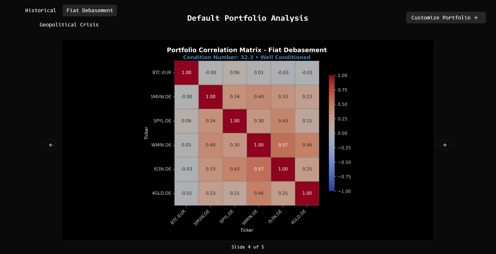

# Quantitative Portfolio Platform

Full-stack quantitative finance platform with **Python optimization & simulation engine**, **FastAPI backend**, and **React frontend**. Features Monte Carlo simulation, portfolio optimization, regime-dependent risk modeling, customizable portfolios and real-time WebSocket updates. Test your portfolio strategies using real market data, professional financial mathematics, and an intuitive web interface.

## 🎯 Project Overview

- **Portfolio optimization**: Efficient frontier calculation with maximum Sharpe ratio identification using CVXPY
- **Monte Carlo simulation**: 1000 paths showing potential portfolio outcomes with VaR/CVaR risk metrics and confidence intervals
- **Fully customizable portfolios** with interactive web interface - modify tickers, weights, asset count, mean/volatility factors, and correlation adjustments
- **Real-time WebSocket updates**: Live market data widget showing current portfolio performance and asset prices during trading hours
- **Professional visualizations**: Interactive charts with Monte Carlo paths, efficient frontiers, correlation matrices, and risk analysis
- **Modern DevOps**: Poetry dependency management, Docker containerization, GCP Cloud Run deployment, CI/CD ready

## 📸 Screenshots & Demo

**Live Frontend**: [mc-frontend (Cloud Run)](https://mc-frontend-668378177815.europe-west1.run.app)
**Live Backend API**: [mc-backend (Cloud Run)](https://mc-backend-668378177815.europe-west1.run.app/docs)

### Default Portfolio Dashboard


_Interactive dashboard with portfolio composition and regime analysis_

### Portfolio Optimization Results


_Efficient frontier showing optimal risk-return portfolios with maximum Sharpe ratio highlighted_

### Monte Carlo Simulation Results


_1000 simulation paths showing potential portfolio outcomes with confidence intervals_

### Portfolio Builder Interface


_Interactive form with real-time validation - create any portfolio combination_

### Risk Analysis Dashboard

<details>
<summary>📊 View Additional Analysis Charts</summary>


_Asset correlation heatmap showing regime-dependent relationships_


_Principal component analysis identifying dominant risk factors_

</details>

## 🏗️ Architecture & Features

**Modular Monolith Architecture:**

- **Backend** (`backend/`) - Organized monolith with modular structure: simulation & optimization engines, shared core utilities, and FastAPI API layer
  - `core/` - Shared utilities (logging, data fetching, risk metrics, FRED API, WebSocket live prices)
  - `simulation/` - Monte Carlo engine with regime-dependent risk modeling
  - `optimization/` - CVXPY-based portfolio optimization with efficient frontier calculation
- **Frontend** (`frontend/src/`) - React dashboard with TypeScript, interactive visualizations, and real-time validation

**Technology Stack:**

- **Backend**: Python, FastAPI, WebSockets, CVXPY, NumPy, Pandas, yfinance, FRED API, Poetry
- **Frontend**: React 19, TypeScript, Vite, shadcn/ui, Recharts, TanStack Query, Zustand
- **Testing & Quality**: pytest, comprehensive test coverage, type hints
- **DevOps**: Docker, Google Cloud Run, Poetry dependency management

## 🎨 Frontend Features

**Interactive Portfolio Dashboard:**

- **Portfolio Composition Chart** - Pie chart visualization of asset weights
- **Live Price Widget** - Real-time market data showing current portfolio performance during trading hours
- **Regime Factors Radar Chart** - Visual comparison of mean/volatility factors and correlation adjustments
- **Efficient Frontier Visualization** - Interactive scatter plot showing optimal risk-return portfolios with maximum Sharpe ratio
- **Monte Carlo Analysis** - Simulation paths, correlation matrix heatmap, and PCA risk factor analysis

**Fully Customizable Form:**

- **Dynamic asset management** - Add/remove tickers with real-time validation
- **Custom weightings** - Adjustable portfolio weights with automatic normalization
- **Date range selection** - Historical data period customization
- **Regime parameter tuning** - Individual mean/volatility factors per asset
- **Global correlation adjustment** - Portfolio-wide correlation modification
- **Real-time feedback** - Form validation with error messages and success indicators

## 📊 Backend Simulation Features

**Generated Outputs (each regime produces):**

- **Efficient frontier charts** - Optimal risk-return portfolios with maximum Sharpe ratio identification
- **Monte Carlo simulation paths** - Confidence intervals, key trajectories, risk metrics (VaR, CVaR)
- **Correlation matrix heatmap** - Asset correlations with matrix conditioning analysis
- **PCA risk factor analysis** - Principal components, explained variance, factor loadings

**Key Metrics:**

- **Portfolio performance**: Expected returns, volatility, Sharpe ratios for all optimization points
- **Risk assessment**: VaR/CVaR calculations, confidence intervals, Monte Carlo stress testing
- **Risk factor analysis**: PCA identification of dominant factors and asset contribution analysis

**Advanced Mathematical Methodology:**

- **Data Foundation**: Historical daily returns from Yahoo Finance API with comprehensive data validation
- **Efficient Frontier**: Quadratic optimization minimizing portfolio variance w^T·Σ·w subject to return constraints μ^T·w = target, using convex programming to find optimal risk-return tradeoffs
- **Regime Modeling**: Two-stage covariance adjustment process:
  - _Stage 1_: Scale each covariance element Σ[i,j] by vol_factor[i] × vol_factor[j], preserving correlation structure while adjusting joint risk magnitudes
  - _Stage 2_: Extract correlation matrix, apply regime-specific correlation_move_pct to off-diagonal elements, then reconstruct covariance with numerical clipping to [-1,1]
- **Monte Carlo Engine**: 1000 simulations using multivariate normal sampling over 252 trading days with regime-adjusted parameters
- **Risk Factor Analysis**: PCA identifies key risk factors (eigenvalue > 1.0 threshold) with smart asset selection (top 2 contributors or all above 10% threshold)
- **Risk Metrics**: Professional VaR/CVaR calculations at 95% and 99% confidence levels with percentile-based path analysis
- **Numerical Stability**: Ensures mathematical validity through correlation matrix conditioning and eigenvalue monitoring
- **Assumptions**: Frictionless markets (no transaction costs), perfect daily rebalancing, normally distributed returns

## 🚀 API Endpoints

### Core APIs (Portfolio & Validation)

- **`GET /api/portfolio/default`** - Default 6-asset portfolio composition and date range
- **`POST /api/portfolio/validate`** - Validate portfolio tickers, weights, and date ranges
- **`GET /api/regimes`** - Available regime scenarios with descriptions
- **`GET /api/regimes/{regime}/parameters`** - Regime-specific factor adjustments
- **`WebSocket /api/ws/live-prices`** - Real-time market data streaming for portfolio assets

### Simulation APIs (Monte Carlo)

- **`POST /api/simulate/{regime}`** - Run Monte Carlo simulation for default portfolio
- **`POST /api/simulate/custom`** - Run simulation for fully customizable portfolio with custom regime parameters

### Optimization APIs (Efficient Frontier)

- **`POST /api/optimize/{regime}`** - Calculate efficient frontier and maximum Sharpe ratio for default portfolio
- **`POST /api/optimize/custom`** - Run portfolio optimization for custom assets with regime-specific factors

## 📚 Educational Value

This project bridges fundamental mathematical concepts with real-world financial applications, demonstrating:

**What You'll Learn:**

- **Linear Algebra in Action**: Matrix operations, PCA, and correlation analysis applied to real financial data
- **Statistics & Probability**: Monte Carlo methods, risk calculations, and working with correlated random variables
- **Financial Modeling**: Portfolio theory, regime analysis, and professional risk metrics (VaR/CVaR)
- **Full-Stack Development**: Python backend, React frontend, API design, and data visualization
- **Production Skills**: Error handling, data validation, performance optimization, and deployment
- **Modern Development Practices**: AI-assisted development with Cursor and Claude Code, demonstrating AI literacy and prompt engineering skills

This project shows how foundational math and programming knowledge can be applied to build real financial analysis tools.

## 📊 Default Portfolio Composition

| Asset                            | Ticker  | Weight | Description                     |
| -------------------------------- | ------- | ------ | ------------------------------- |
| Bitcoin                          | BTC-EUR | 60%    | Cryptocurrency hedge            |
| iShares MSCI World Energy Sector | 5MVW.DE | 13%    | Global developed energy markets |
| SPDR S&P 500                     | SPYL.DE | 10.5%  | US large-cap stocks             |
| VanEck S&P Global Mining         | WMIN.DE | 7%     | Global miners                   |
| iShares Core MSCI EM IMI         | IS3N.DE | 6%     | Emerging market stocks          |
| Gold                             | 4GLD.DE | 3.5%   | Precious metals                 |

## 🚀 Installation & Setup

**Prerequisites (local dev):** Python 3.13+, Node.js 18+, Poetry
**Prerequisites (production):** GitHub repository with CI/CD secrets configured (see `.github/SETUP.md`)

### Backend Setup

```bash
# Clone repository
git clone <repository-url>
cd monte-carlo

# Install Python dependencies with Poetry
cd backend && poetry install

# Run API server
cd backend && poetry run uvicorn app:app --reload --port 8000
```

### Frontend Setup

```bash
# In new terminal, navigate to frontend
cd frontend

# Install dependencies
npm install

# Run development server
npm run dev          # Development (port 5173)
npm run build        # Production build
npm run preview      # Preview production build
```

## 📈 Usage

### Full-Stack Web Application

Start services using the commands in Installation & Setup above, then open:

- Frontend: http://localhost:5173
- Backend: http://localhost:8000

### Automated Deployment (CI/CD)

**Production deployment is fully automated via GitHub Actions:**

1. **One-time setup**: Configure GitHub Secrets (see `.github/SETUP.md` for details)
2. **Deploy**: Simply push to `main` branch - GitHub Actions handles testing and deployment automatically
3. **Monitor**: Check GitHub Actions tab for deployment status and logs

**Manual deployment** (if needed):

```bash
# Configure gcloud and create repository
gcloud auth login
gcloud config set project YOUR_PROJECT_ID
gcloud config set run/region europe-west1
gcloud services enable run.googleapis.com artifactregistry.googleapis.com
gcloud artifacts repositories create mc --repository-format=docker --location=europe-west1
gcloud auth configure-docker europe-west1-docker.pkg.dev

# Build and deploy backend
docker build -t montecarlo-backend ./backend
docker tag montecarlo-backend europe-west1-docker.pkg.dev/YOUR_PROJECT_ID/mc/montecarlo-backend:latest
docker push europe-west1-docker.pkg.dev/YOUR_PROJECT_ID/mc/montecarlo-backend:latest
gcloud run deploy mc-backend \
  --image europe-west1-docker.pkg.dev/YOUR_PROJECT_ID/mc/montecarlo-backend:latest \
  --allow-unauthenticated

# Get backend URL and deploy frontend
BACKEND_URL=$(gcloud run services describe mc-backend --region=europe-west1 --format='value(status.url)')
docker build --build-arg VITE_API_URL=$BACKEND_URL -t montecarlo-frontend ./frontend
docker tag montecarlo-frontend europe-west1-docker.pkg.dev/YOUR_PROJECT_ID/mc/montecarlo-frontend:latest
docker push europe-west1-docker.pkg.dev/YOUR_PROJECT_ID/mc/montecarlo-frontend:latest
gcloud run deploy mc-frontend \
  --image europe-west1-docker.pkg.dev/YOUR_PROJECT_ID/mc/montecarlo-frontend:latest \
  --allow-unauthenticated
```

### Standalone Python Simulation

```bash
# Run all scenarios (generates backend/simulation/charts/ folder)
cd backend && poetry run python -m simulation.main
```

## 🔧 Development Commands

### Poetry Dependency Management

```bash
# Add new dependency
poetry add package_name

# Add development dependency
poetry add --group dev package_name

# Show installed packages
poetry show

# Update dependencies
poetry update

# Activate virtual environment
poetry shell

# Run any command in Poetry environment
poetry run <command>
```
